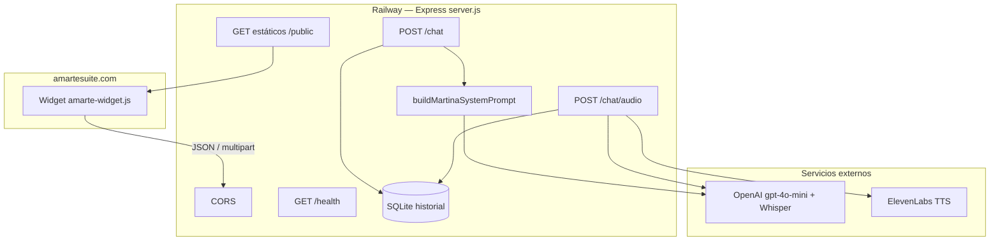
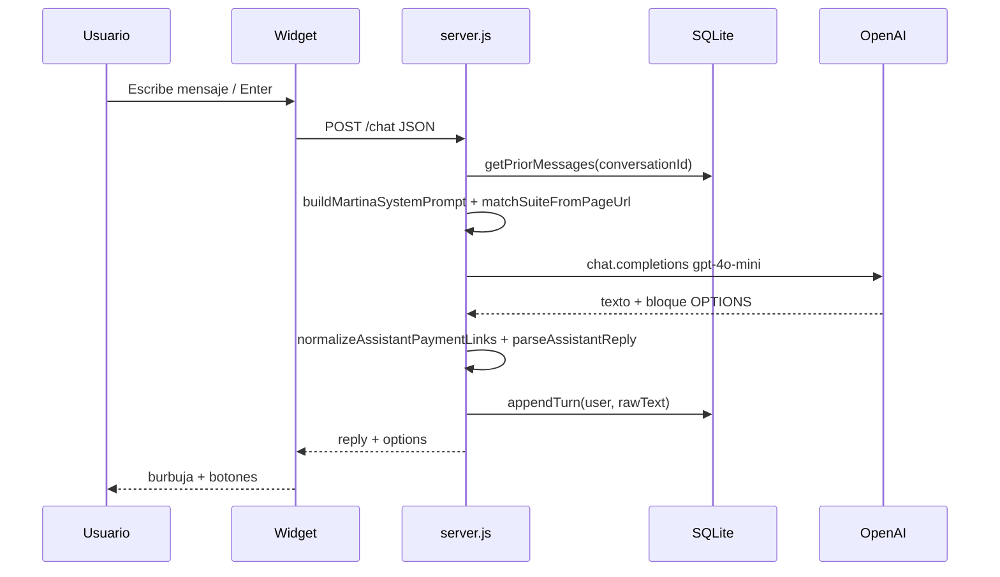

# Dosier del proyecto — ChatBotAmarte

**Versión del documento:** 1.0  
**Producto:** Concierge de IA “Martina” para Hotel Amarte Suite  
**Repositorio:** `ChatBotAmarte`  
**Producción:** [https://chatbotamarte-production.up.railway.app](https://chatbotamarte-production.up.railway.app)  
**Sitio anfitrión:** [https://amartesuite.com](https://amartesuite.com)

---

## 1. Resumen ejecutivo

ChatBotAmarte es un sistema compacto de **backend + widget embebible** que permite a los visitantes de Amarte Suite conversar con **Martina**, una asistente virtual que:

- Informa sobre suites, planes y tarifas en COP (fuente única: catálogo interno).
- Orienta el flujo de reserva (fecha, tipo de suite/plan, duración).
- Ofrece enlaces a reservas, promociones, pago Wompi y WhatsApp.
- Soporta chat por **texto** y por **voz** (Whisper + ElevenLabs).
- Recuerda el contexto de la conversación mediante **SQLite** y un `conversationId` en el navegador.

El diseño es deliberadamente simple: poca superficie de código, lógica de negocio en archivos de configuración, y un único punto de entrada (`server.js`).

---

## 2. Objetivos del sistema

| Objetivo | Cómo se cumple |
|----------|----------------|
| Atender consultas 24/7 en el sitio web | Widget flotante “Pregúntale a Martina” |
| Cotizar con precios reales | Catálogo en `config/amarteCatalog.js` inyectado al prompt |
| No inventar promociones | Memoria operativa + reglas del system prompt |
| Facilitar conversión | Botones: Reservar, PROMOCIONES, Pago Wompi, WhatsApp |
| Contextualizar por página | Detección de suite vía `pageUrl` (`suitePageHints.js`) |
| Experiencia móvil | UI glassmorphism, launcher tipo píldora, voz |

---

## 3. Arquitectura general



### Capas

| Capa | Tecnología | Archivo principal |
|------|------------|-------------------|
| Servidor HTTP | Express 4 | `server.js` |
| Chat IA | OpenAI `gpt-4o-mini` | `runChat()` en `server.js` |
| Transcripción | OpenAI Whisper `whisper-1` | `POST /chat/audio` |
| Síntesis de voz | ElevenLabs `eleven_multilingual_v2` | `synthesizeElevenLabs()` |
| Negocio / tarifas | JS estático | `config/amarteCatalog.js` |
| System prompt | Composición dinámica | `config/martinaSystemPrompt.js` |
| Memoria operativa | Markdown | `config/memoria.md` + `loadMemoria.js` |
| Historial | SQLite (`better-sqlite3`) | `conversationStore.js` |
| Widget UI | Vanilla JS + CSS inyectado | `public/amarte-widget.js` |
| Enlaces de pago | Normalización defensiva | `paymentLinks.js` |

---

## 4. Estructura del repositorio

```
ChatBotAmarte/
├── server.js                 # Entry point: rutas, OpenAI, ElevenLabs, CORS, estáticos
├── conversationStore.js      # Persistencia SQLite del historial
├── paymentLinks.js           # Normalización de URLs Wompi corruptas
├── package.json              # Dependencias y scripts
├── .env.example              # Plantilla de variables (sin secretos)
├── .gitignore                # Ignora .env, node_modules, data/, memoria.local.md
├── DOSIER.md                 # Este documento
│
├── config/
│   ├── amarteCatalog.js      # Fuente de verdad comercial (suites, precios, contacto, pago)
│   ├── martinaSystemPrompt.js# Ensambla el system prompt de Martina
│   ├── loadMemoria.js        # Carga memoria Markdown al prompt
│   ├── memoria.md            # Políticas y campañas operativas
│   └── suitePageHints.js     # Detecta suite a partir de la URL de la página
│
├── public/
│   ├── amarte-widget.js      # Widget embebible (UI + cliente API)
│   └── embed-demo.html       # Página de prueba del widget
│
├── scripts/
│   └── verify-production.ps1 # Smoke test contra producción Railway
│
└── tests/
    └── paymentLinks.test.js  # Pruebas de normalización Wompi
```

**Notas:**

- La carpeta `data/` se crea en runtime para SQLite y está en `.gitignore`.
- `config/memoria.local.md` puede usarse como override local (también ignorado por git).

---

## 5. Flujos de conversación

### 5.1 Chat por texto — `POST /chat`



**Payload típico del widget:**

```json
{
  "message": "¿Cuánto cuesta la Suite Jacuzzi?",
  "roomName": "document.title",
  "pageUrl": "https://amartesuite.com/producto/...",
  "conversationId": "uuid-v4",
  "referenceDate": "YYYY-MM-DD",
  "referenceTime": "HH:mm",
  "referenceWeekday": "viernes",
  "referenceIso": "YYYY-MM-DDTHH:mm:00-05:00"
}
```

La referencia temporal se calcula en el cliente con zona **America/Bogota** (`getBogotaReference()`), para que Martina sepa “hoy/mañana” y si aplica tarifa entre semana o fin de semana.

**Respuesta:**

```json
{
  "reply": "Texto visible para el usuario",
  "options": [
    { "label": "📅 Reservar ahora", "url": "..." },
    { "label": "🎁 PROMOCIONES", "url": "..." },
    { "label": "💳 Pago seguro Wompi", "url": "..." },
    { "label": "💬 WhatsApp", "url": "..." }
  ]
}
```

### 5.2 Chat por voz — `POST /chat/audio`

1. El usuario graba con el micrófono (`MediaRecorder`, máx. ~120 s, preferencia `audio/webm;codecs=opus`).
2. El widget envía `multipart/form-data` con el audio y el mismo contexto (room, page, conversationId, temporal).
3. El servidor:
   - Transcribe con **Whisper** (`language: "es"`).
   - Ejecuta el mismo núcleo `runChat()` con el transcript.
   - Opcionalmente sintetiza la respuesta con **ElevenLabs** (si hay `ELEVENLABS_API_KEY`).
4. Respuesta incluye `transcript`, `reply`, `options`, `ttsStatus` y, si aplica, `audioBase64` + `audioMimeType`.

El widget muestra el transcript como mensaje de usuario y reproduce el audio de Martina cuando está disponible.

---

## 6. System prompt y conocimiento de negocio

### 6.1 Cómo se arma el prompt

La función `buildMartinaSystemPrompt(context)` en `config/martinaSystemPrompt.js` combina:

| Fuente | Contenido |
|--------|-----------|
| `amarteCatalog.js` | Identidad, tono, categorías de suites, tarifas COP, servicios, flujo de reserva, ubicación, pago, contacto |
| `memoria.md` | Políticas y campañas (máx. ~12 000 caracteres) |
| `suitePageHints.js` | Suite detectada por pathname de la página actual |
| Contexto runtime | `roomName`, `pageUrl`, fecha/hora Bogotá |

### 6.2 Reglas críticas de Martina

- **Solo cotiza** tarifas del catálogo interno; no inventa descuentos.
- **Promociones:** invita a la landing oficial, no cita precios de landings que contradigan el catálogo.
- **Zona horaria:** Bogotá para “hoy/mañana” y weekday vs weekend.
- **Formato de salida obligatorio:** texto visible + bloque `[OPTIONS]...[/OPTIONS]` con JSON de botones.
- **Wompi en texto:** URL completa en plano (sin Markdown `[texto](url)`), para evitar corrupción del enlace.

### 6.3 Contrato `[OPTIONS]`

El modelo debe terminar cada respuesta así:

```
[OPTIONS]
[
  {"label": "📅 Reservar ahora", "url": "..."},
  {"label": "🎁 PROMOCIONES", "url": "..."},
  {"label": "💳 Pago seguro Wompi", "url": "..."},
  {"label": "💬 WhatsApp", "url": "..."}
]
[/OPTIONS]
```

`parseAssistantReply()` separa el texto visible del JSON. Las URLs de pago se normalizan con `normalizePaymentOptionUrl()`.

---

## 7. Widget frontend

### 7.1 Carga

- Archivo: `public/amarte-widget.js` (IIFE, sin dependencias externas).
- Guard anti-doble carga: `window.__amarteWidgetLoaded`.
- Al iniciar: inyecta CSS (`injectStyles`) y construye el DOM (`buildWidget`).

### 7.2 Resolución de `BACKEND_URL` (prioridad)

1. `window.AMARTE_CHATBOT_URL`
2. Origen del `<script src=".../amarte-widget.js">`
3. `window.location.origin` (útil en demo local)

### 7.3 Overrides opcionales

| Variable global | Uso |
|-----------------|-----|
| `AMARTE_CHATBOT_URL` | Base del API |
| `AMARTE_QUICK_WHATSAPP_URL` | Botón WhatsApp del pie |
| `AMARTE_QUICK_RESERVATIONS_URL` | Botón Reservar |
| `AMARTE_PROMOCIONES_URL` | Botón PROMOCIONES |
| `AMARTE_QUICK_CALL_TEL` | Botón Llamar (`tel:`) |

### 7.4 UI actual

| Elemento | Descripción |
|----------|-------------|
| **Launcher** | Píldora magenta “Pregúntale a Martina” + icono chat; esquina inferior derecha |
| **Panel** | Glassmorphism: fondo blanco 75 %, blur 15 px, radio 25 px, borde blanco |
| **Header** | Título “Amarte Suite” en magenta; subtítulo “Concierge” en gris; sin fondo sólido |
| **Mensajes** | Burbujas usuario (gradiente magenta) / bot (blanco); Markdown ligero |
| **Pie** | Input píldora, micrófono SVG magenta, enviar circular magenta |
| **Accesos rápidos** | WhatsApp, Llamar (solo móvil), Reservar, PROMOCIONES — píldoras magenta sólidas |

Al abrir el chat, el launcher se oculta con transición (`amarte-chat-open`).

### 7.5 Identidad de conversación

`conversationId` UUID v4 guardado en `localStorage` (`amarte_conversation_id`), con fallback a `sessionStorage` y luego UUID efímero.

---

## 8. Persistencia (SQLite)

**Módulo:** `conversationStore.js`

```sql
CREATE TABLE chat_messages (
  id INTEGER PRIMARY KEY AUTOINCREMENT,
  conversation_id TEXT NOT NULL,
  role TEXT NOT NULL,
  content TEXT NOT NULL,
  created_at TEXT DEFAULT (datetime('now'))
);
```

| Función | Rol |
|---------|-----|
| `initConversationStore(path)` | Abre DB y crea tabla |
| `getPriorMessages(id, limit=40)` | Últimos N mensajes en orden cronológico |
| `appendTurn(id, user, assistantRaw)` | Inserta turno usuario + asistente (incluye `[OPTIONS]`) |

Si SQLite falla al iniciar, el chat **sigue funcionando** sin historial (warning en consola).

En Railway el disco puede ser efímero: el historial puede perderse entre redeploys salvo que se monte un volumen persistente.

---

## 9. Normalización de enlaces Wompi

**Problema histórico:** el Markdown del widget interpretaba el `_` de `VPOS_RXJqnz` como cursiva y generaba URLs corruptas (`VPOS%3Cem%3ERXJqnz`).

**Solución en capas:**

1. **Prompt:** pedir URL Wompi en texto plano.
2. **Backend** (`paymentLinks.js`): reescribe variantes corruptas y Markdown de “Pago seguro Wompi” a la URL canónica.
3. **Widget:** normaliza por URL y por etiqueta del enlace antes de crear el `<a href>`.

**URL canónica:** `https://checkout.wompi.co/l/VPOS_RXJqnz`

**Tests:** `node tests/paymentLinks.test.js`

---

## 10. API pública

| Método | Ruta | Descripción |
|--------|------|-------------|
| `GET` | `/` | Página informativa + snippet de embed |
| `GET` | `/health` | Estado: OpenAI, ElevenLabs, historial |
| `POST` | `/chat` | Chat texto → `{ reply, options }` |
| `POST` | `/chat/audio` | Audio → transcript + reply + TTS opcional |
| `GET` | `/amarte-widget.js` | Widget (Cache-Control: no-cache) |
| `GET` | `/embed-demo.html` | Demo local |

**CORS permitido:** `https://amartesuite.com`, `https://www.amartesuite.com`.

No hay autenticación de API; la protección principal en navegador es CORS.

---

## 11. Configuración y despliegue

### 11.1 Variables de entorno

| Variable | Obligatoria | Default / notas |
|----------|-------------|-----------------|
| `OPENAI_API_KEY` | Sí | Sin ella, `/chat` y `/chat/audio` fallan |
| `PORT` | No | `3000` (Railway la inyecta) |
| `ELEVENLABS_API_KEY` | No | Sin ella hay chat, pero sin voz de respuesta |
| `ELEVENLABS_VOICE_ID` | No | `VmejBeYhbrcTPwDniox7` |
| `CHAT_DB_PATH` | No | `./data/conversations.sqlite` |
| `MARTINA_MEMORIA_PATH` | No | `./config/memoria.md` |

### 11.2 Scripts npm

| Script | Comando |
|--------|---------|
| `npm start` | Arranca el servidor |
| `npm run verify:prod` | Smoke test contra Railway |
| `npm run railway:up` | Deploy con Railway CLI |
| `npm run railway:logs` | Logs del servicio |

### 11.3 Dependencias

`express`, `cors`, `dotenv`, `openai`, `multer`, `better-sqlite3`  
**Node:** `>= 18`

### 11.4 Arranque local

```bash
copy .env.example .env
# Editar OPENAI_API_KEY (y opcionalmente ElevenLabs)
npm install
npm start
```

Demo del widget: [http://localhost:3010/embed-demo.html](http://localhost:3010/embed-demo.html) (si `PORT=3010` en `.env`).

### 11.5 Embed en WordPress / amartesuite.com

```html
<script>
  window.AMARTE_CHATBOT_URL = "https://chatbotamarte-production.up.railway.app";
</script>
<script src="https://chatbotamarte-production.up.railway.app/amarte-widget.js?v=ACTUALIZA_ESTE_VALOR"></script>
```

Tras cada cambio visual o de lógica del widget, **actualizar el `?v=`** para forzar recarga en navegadores con caché.

---

## 12. Datos de negocio (sin secretos)

### Identidad

- Asistente: **Martina**
- Hotel: **Hotel Amarte Suite**
- Tono: cálido, profesional, persuasivo

### Contacto y conversión

| Canal | Valor |
|-------|-------|
| WhatsApp | `+57 300 741 6683` (mensaje prellenado al abrir) |
| Teléfono (widget) | `tel:+573013307909` |
| Reservas | [Formulario de reservas](https://amartesuite.com/formulario-reservas-amarte-suite/) |
| Promociones | [Landing Jacuzzi](https://amartesuite.com/suite-jacuzzi-mejor-precio/) |
| Pago Wompi | [Checkout VPOS_RXJqnz](https://checkout.wompi.co/l/VPOS_RXJqnz) |
| Ubicación | Calle 62 No. 14–19, Teusaquillo, Bogotá — [mapa](https://bit.ly/ubicacionAmarte) |

### Categorías de suites

- **Deluxe:** Diamante, Gold, Rubí, Zafiro  
- **Temáticas:** Árabe, Gótica, Queen  
- **Jacuzzi:** VIP Jacuzzi  
- **Sencillas:** Cabaña, Movimiento, Amarte  

### Tarifas (resumen)

- **Entre semana:** domingo–jueves  
- **Fin de semana:** viernes–sábado  
- **Suites:** 4 h / 8 h / 12 h / día hotelero (2:00 p.m. – 12:00 m. día siguiente)  
- **Planes:** 6 h / 12 h / día hotelero  

Las cifras exactas viven en `config/amarteCatalog.js` (única fuente que Martina debe usar al cotizar).

### Flujo de reserva (3 pasos en el prompt)

1. Fecha y hora de ingreso  
2. Tipo de suite o plan  
3. Pack de tiempo (4/6/8/12 h o día hotelero)

---

## 13. Mapa de responsabilidades (dónde cambiar qué)

| Quiero cambiar… | Archivo |
|-----------------|---------|
| Precios, suites, URLs de producto | `config/amarteCatalog.js` |
| Políticas / campañas / tono operativo | `config/memoria.md` |
| Instrucciones de comportamiento de Martina | `config/martinaSystemPrompt.js` |
| Detección de suite por URL | `config/suitePageHints.js` |
| UI del chat / launcher / estilos | `public/amarte-widget.js` |
| Rutas API, CORS, TTS, Whisper | `server.js` |
| Historial SQLite | `conversationStore.js` |
| Corrección de enlaces Wompi | `paymentLinks.js` (+ widget) |
| Variables de entorno | `.env` local / Variables en Railway |

---

## 14. Operación y verificación

### Health check

```
GET https://chatbotamarte-production.up.railway.app/health
```

Esperado: `ok: true`, `openaiConfigured: true`.

### Smoke test automatizado

```bash
npm run verify:prod
```

Comprueba `/health`, presencia del fix Wompi en el widget y una respuesta de `/chat` con URL de pago correcta.

### Checklist post-deploy

1. Deploy en Railway (`railway up` o redeploy en dashboard).  
2. `/health` responde OK.  
3. Widget carga desde la URL de Railway.  
4. Actualizar `?v=` en el embed de WordPress.  
5. Probar en incógnito: mensaje “enlace de pago” y botón Reservar / WhatsApp.

---

## 15. Limitaciones conocidas

| Limitación | Implicación |
|------------|-------------|
| Sin auth en API | Cualquier cliente puede llamar al backend; CORS solo protege en navegador |
| SQLite en disco efímero (Railway free/hobby) | Historial puede perderse al redeploy |
| Auto-deploy GitHub puede no estar activo | A menudo hace falta `railway up` o redeploy manual |
| Caché del widget en WordPress | Requiere bump de `?v=` tras cambios de UI |
| Modelo `gpt-4o-mini` | Barato y rápido; puede omitir `[OPTIONS]` ocasionalmente |

---

## 16. Glosario

| Término | Significado |
|---------|-------------|
| **Martina** | Nombre de la asistente virtual |
| **Widget** | Script embebido que dibuja el chat en el sitio |
| **System prompt** | Instrucciones fijas enviadas a OpenAI en cada turno |
| **Catálogo** | Precios y datos comerciales canónicos |
| **Memoria** | Markdown operativo (políticas/campañas) |
| **OPTIONS** | Bloque JSON de botones al final de cada respuesta |
| **Launcher** | Botón flotante “Pregúntale a Martina” |
| **Glassmorphism** | Estilo visual del panel (vidrio translúcido + blur) |

---

## 17. Conclusión

ChatBotAmarte es un **concierge conversacional de producción** orientado a conversión: combina un backend Express ligero, un widget autocontenido y un catálogo comercial como fuente de verdad. La complejidad está concentrada en el **prompt** y en la **integridad de los enlaces de pago**, no en una arquitectura pesada.

Para evolucionar el producto con bajo riesgo:

1. Actualizar negocio en `amarteCatalog.js` / `memoria.md`.  
2. Ajustar UX solo en `amarte-widget.js`.  
3. Verificar con `npm run verify:prod` tras cada deploy.

---

*Documento generado a partir del código del repositorio. No incluye secretos ni claves de API.*
