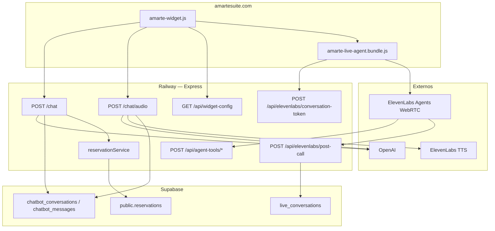
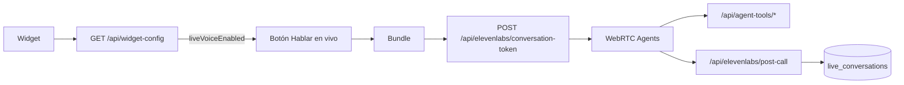

# Dosier del proyecto — ChatBotAmarte

**Versión del documento:** 2.1  
**Producto:** Concierge de IA “Martina” para Hotel Amarte Suite  
**Repositorio:** `ChatBotAmarte`  
**Producción:** [https://chatbotamarte-production.up.railway.app](https://chatbotamarte-production.up.railway.app)  
**Sitio anfitrión:** [https://amartesuite.com](https://amartesuite.com)  
**Supabase (SaaS reservas):** [https://dftbelnombbtjryqphaa.supabase.co](https://dftbelnombbtjryqphaa.supabase.co)

---

## 1. Resumen ejecutivo

ChatBotAmarte es un sistema de **backend + widget embebible** que permite a los visitantes de Amarte Suite conversar con **Martina** en tres modos:

| Modo | Canal | Tecnología |
|------|--------|------------|
| Chat escrito | `POST /chat` | OpenAI `gpt-5.4-mini` (JSON schema) |
| Nota de voz | `POST /chat/audio` | STT OpenAI + chat + ElevenLabs TTS |
| Hablar en vivo | WebRTC | ElevenLabs Agents + tools + webhook post-call |

Además:

- Cotiza suites/planes desde Supabase `room_rates` (única fuente de precios de lista).
- Describe includes de planes con emojis (decoración, kit erótico, etc.).
- Crea **prerreservas pendientes** en el SaaS (`public.reservations`, `canal=Chatbot`).
- Persiste historial y sesiones en vivo en **Supabase**.

Punto de entrada: `server.js`. Documentación corta: `README.md`. Setup Agents: `docs/ELEVENLABS_*.md`.

---

## 2. Objetivos del sistema

| Objetivo | Cómo se cumple |
|----------|----------------|
| Atender 24/7 en el sitio | Widget “Pregúntale a Martina” |
| Cotizar precios reales | Supabase `room_rates` vía `services/roomRatesCatalog.js` + `catalogLookup.js` (fallback: `amarteCatalog.js`) |
| No inventar promociones | Prompt + memoria operativa |
| Conversión | Botones Reservar / PROMOCIONES / Wompi / WhatsApp |
| Prerreservas en el SaaS | `reservationService.js` |
| Conversación oral en tiempo real | ElevenLabs Agents + `amarte-live-agent.bundle.js` |
| Contextualizar por página | `suitePageHints.js` + variables dinámicas del agente |
| UX móvil | Glassmorphism, mic nota de voz, overlay “Hablar en vivo” |

---

## 3. Arquitectura general



### Capas

| Capa | Tecnología | Archivo(s) |
|------|------------|------------|
| Servidor HTTP | Express 4 + rate-limit | `server.js`, `routes/*` |
| Chat IA | OpenAI `gpt-5.4-mini` | `runChat()` |
| STT | `gpt-4o-mini-transcribe` | `POST /chat/audio` |
| TTS nota de voz | ElevenLabs multilingual v2 | `synthesizeElevenLabs()`, `ttsNormalize.js` |
| Hablar en vivo | VoiceAgentManager + ElevenLabsProvider | `liveVoiceConfig.js`, `src/voice/`, `routes/elevenlabs*` |
| Tools del agente | Bearer `ELEVENLABS_TOOL_SECRET` | `routes/agentTools.js`, `services/catalogLookup.js` |
| Catálogo / prompt | JS + Markdown | `config/*` |
| Historial chat | Supabase | `conversationStore.js`, `supabaseClient.js` |
| Sesiones en vivo | Supabase `live_conversations` | post-call + `conversationStore` |
| Prerreservas | Supabase `reservations` | `reservationService.js` |
| Tiempo Bogotá | Intl | `services/bogotaTime.js` |
| Validación live | Hosts / campos | `services/liveVoiceValidation.js` |
| Analytics live | Hook / debug | `analytics.js` |
| Widget | Vanilla JS | `public/amarte-widget.js` |
| Bundle live | esbuild IIFE | `npm run build:voice` → `public/amarte-live-agent.bundle.js` |

---

## 4. Estructura del repositorio

```
ChatBotAmarte/
├── server.js
├── supabaseClient.js
├── conversationStore.js      # chat + helpers live_conversations
├── reservationService.js
├── liveVoiceConfig.js        # flags, rate limit token, hosts permitidos
├── analytics.js              # trackEvent (live voice)
├── paymentLinks.js
├── ttsNormalize.js
├── package.json              # prestart → build:voice
├── README.md
├── DOSIER.md
├── .env.example
│
├── config/
│   ├── amarteCatalog.js      # metadata + includes + fallback precios + promo jacuzzi
│   ├── …
│   ├── martinaSystemPrompt.js
│   ├── chatActions.js
│   ├── loadMemoria.js / memoria.md
│   └── suitePageHints.js
│
├── routes/
│   ├── widgetConfig.js       # GET /api/widget-config
│   ├── elevenlabsToken.js    # POST /api/elevenlabs/conversation-token
│   ├── elevenlabsPostCall.js # POST /api/elevenlabs/post-call
│   └── agentTools.js         # POST /api/agent-tools/catalog|actions
│
├── services/
│   ├── bogotaTime.js
│   ├── catalogLookup.js      # tarifas para tools del agente
│   └── liveVoiceValidation.js
│
├── src/
│   └── voice/                # VoiceAgentManager + providers (ElevenLabs, stub OpenAI)
│
├── public/
│   ├── amarte-widget.js
│   ├── amarte-live-agent.bundle.js  # generado
│   └── embed-demo.html
│
├── docs/
│   ├── ELEVENLABS_AGENT_SETUP.md
│   ├── ELEVENLABS_TOOLS_SETUP.md
│   └── ELEVENLABS_POST_CALL_WEBHOOK.md
│
├── supabase/migrations/
│   └── 20260710_live_conversations.sql
│
└── tests/   # paymentLinks, chatActions, ttsNormalize, reservationService,
             # bogotaTime, catalogLookup, liveVoice*, agentTools,
             # elevenlabsPostCall, conversationToken, rateLimit
```

---

## 5. Flujos de conversación

### 5.1 Chat escrito — `POST /chat`

1. Widget envía mensaje + `conversationId` + contexto temporal Bogotá.  
2. Servidor carga historial Supabase → `runChat()` (JSON schema).  
3. Si `pendingReservation` válido → INSERT prerreserva.  
4. `appendTurn` guarda user + assistant.  
5. Respuesta: `{ reply, options, reservationId? }`.

### 5.2 Nota de voz — `POST /chat/audio`

1. Micrófono: **magenta** idle → **verde** al grabar → magenta al finalizar.  
2. Hint: *“Presiona el micrófono para hablar y nuevamente para finalizar”*.  
3. STT → mismo `runChat()` → TTS ElevenLabs opcional.

### 5.3 Hablar en vivo — ElevenLabs Agents



1. Widget consulta `/api/widget-config`; si `liveVoiceEnabled`, muestra el botón.  
2. Carga `amarte-live-agent.bundle.js` bajo demanda.  
3. Overlay de permiso → token WebRTC (rate limit: 5 / 10 min).  
4. Sesión con variables dinámicas (`conversation_id`, `suite_context`, fecha Bogotá, etc.).  
5. Tools del agente (catálogo / acciones) autenticadas con `ELEVENLABS_TOOL_SECRET`.  
6. Al terminar, webhook post-call (firma HMAC) persiste en `live_conversations`.  
7. Desactivar solo este modo: `ELEVENLABS_LIVE_ENABLED=false`.

Detalle operativo: `docs/ELEVENLABS_AGENT_SETUP.md`, `ELEVENLABS_TOOLS_SETUP.md`, `ELEVENLABS_POST_CALL_WEBHOOK.md`.

### 5.4 Prerreserva desde el chat

1. Tras cotizar exacto, Martina **ofrece** prerreserva; exige **nombre** + **WhatsApp**.  
2. Con aceptación y datos válidos → `pendingReservation` en el JSON.  
3. INSERT `reservations`: `canal=Chatbot`, `is_taken=false`, `suite=—`, abono ~50 %.  
4. Una prerreserva por `conversationId`. Botones prioritarios: Wompi + WhatsApp.

---

## 6. System prompt y catálogo

- Cotización de lista desde Supabase `room_rates` (caché en `roomRatesCatalog.js`; fallback `amarteCatalog.js`).  
- Planes: siempre mencionar includes con emojis.  
  - Base: 🌹 pétalos, 🕯️ velas, 🎈 globos, 🍾 vino espumoso, 🍫 chocolates.  
  - Plan Húmedo: + 🛁 jacuzzi + ♨️ sauna.  
  - Plan Erótico: + kit 🧴 body, ⛓️ esposas, 🪢 látigo.  
- Salida chat: JSON `{ message, actionTypes, pendingReservation }` (`chatActions.js`).  
- En vivo: precios vía tool `catalogLookup` → `room_rates`; URLs de acciones solo desde backend.

---

## 7. Widget frontend

| Elemento | Descripción |
|----------|-------------|
| Launcher | “Pregúntale a Martina” |
| Chat | Input + mic nota de voz (verde/magenta) + hint + enviar |
| Hablar en vivo | Botón (si config lo habilita), overlay, panel mute/unmute/colgar, estados listening/speaking |
| Accesos rápidos | WhatsApp, Llamar (móvil), Reservar, PROMOCIONES |
| Bundle | `/amarte-live-agent.bundle.js` (generado en `prestart`) |

`conversationId` en `localStorage` (`amarte_conversation_id`).

Overrides: `AMARTE_CHATBOT_URL`, `AMARTE_QUICK_*`, `AMARTE_PROMOCIONES_URL`.

---

## 8. Persistencia (Supabase)

**Proyecto:** `dftbelnombbtjryqphaa`. Service role solo en backend.

| Tabla | Uso |
|-------|-----|
| `chatbot_conversations` | Sesión chat; `reservation_id` opcional |
| `chatbot_messages` | Historial user/assistant |
| `live_conversations` | Post-call Agents (transcript, summary, booking_intent, …) |
| `reservations` | Prerreservas SaaS (`canal=Chatbot`) |

Migración live: `supabase/migrations/20260710_live_conversations.sql`.

Historial: init + **reintento lazy** (`ensureStoreReady`). Sin keys → chat sin memoria.

---

## 9. API pública

| Método | Ruta | Descripción |
|--------|------|-------------|
| `GET` | `/health` | openai, elevenLabs, **elevenLabsAgentConfigured**, **liveVoiceEnabled**, chatHistory, supabase |
| `GET` | `/` | Info + embed |
| `POST` | `/chat` | Chat texto |
| `POST` | `/chat/audio` | Nota de voz |
| `GET` | `/api/widget-config` | `{ liveVoiceEnabled }` |
| `POST` | `/api/elevenlabs/conversation-token` | Token WebRTC (rate-limited) |
| `POST` | `/api/agent-tools/catalog` | Precio desde catálogo (tool secret) |
| `POST` | `/api/agent-tools/actions` | URLs canónicas (tool secret) |
| `POST` | `/api/elevenlabs/post-call` | Webhook post-call (firma) |
| `GET` | `/amarte-widget.js` | Widget |
| `GET` | `/amarte-live-agent.bundle.js` | Cliente live |
| `GET` | `/embed-demo.html` | Demo |

**CORS:** `amartesuite.com` / `www.amartesuite.com`.

---

## 10. Configuración y despliegue

### Variables de entorno

| Variable | Uso |
|----------|-----|
| `OPENAI_API_KEY` | Chat + STT |
| `PORT` | Default 3000 |
| `ELEVENLABS_API_KEY` | TTS + Agents |
| `ELEVENLABS_VOICE_ID` | Voz TTS (default Lina) |
| `ELEVENLABS_AGENT_ID` | Agente Conversational AI |
| `ELEVENLABS_ENVIRONMENT` | Default `production` |
| `ELEVENLABS_CONVAI_WEBHOOK_SECRET` | Firma post-call |
| `ELEVENLABS_TOOL_SECRET` | Auth tools del agente |
| `ELEVENLABS_LIVE_ENABLED` | `true`/`false` (botón en vivo) |
| `ELEVENLABS_ALLOW_LOCAL_PAGE_HOSTS` | Demo localhost |
| `SUPABASE_URL` | Proyecto Amarte |
| `SUPABASE_SERVICE_ROLE_KEY` | Backend only |
| `MARTINA_MEMORIA_PATH` | Override memoria |

### Scripts

| Script | Acción |
|--------|--------|
| `npm start` | `prestart` → `build:voice` + `node server.js` |
| `npm run build:voice` | esbuild → `amarte-live-agent.bundle.js` |
| `npm test` | Suite completa (chat + live + rate limit) |
| `npm run verify:prod` | Smoke Railway |
| `npm run railway:up` / `railway:logs` | Deploy / logs |

### Dependencias

**Runtime:** `express`, `cors`, `dotenv`, `openai`, `multer`, `@supabase/supabase-js`, `@elevenlabs/client`, `@elevenlabs/elevenlabs-js`, `express-rate-limit`  
**Dev:** `esbuild`  
**Node:** `>= 18`

### Embed WordPress

```html
<script>
  window.AMARTE_CHATBOT_URL = "https://chatbotamarte-production.up.railway.app";
</script>
<script src="https://chatbotamarte-production.up.railway.app/amarte-widget.js?v=ACTUALIZA"></script>
```

Bump `?v=` tras cambios de UI. **Nunca** poner API keys en el embed.

---

## 11. Datos de negocio (sin secretos)

- **Martina** · Hotel Amarte Suite · tono cálido/profesional.  
- WhatsApp `+57 300 741 6683` · Tel widget `+573013307909`.  
- Formulario reservas, landing promos, Wompi `VPOS_RXJqnz`, Calle 62 Teusaquillo.  
- Suites: Deluxe / Temáticas / Jacuzzi (SaaS: `Suite Jacuzzi`) / Sencillas.  
- Packs: 4/6/8/12 h y día hotelero; weekday vs weekend Bogotá.

---

## 12. Mapa de responsabilidades

| Cambiar… | Dónde |
|----------|--------|
| Precios de lista | Supabase `room_rates` |
| Metadata / includes / fallback | `config/amarteCatalog.js` |
| Prompt chat | `config/martinaSystemPrompt.js` |
| Botones / schema JSON | `config/chatActions.js` |
| UI widget / live overlay | `public/amarte-widget.js` |
| Cliente voz (providers) | `src/voice/` (+ rebuild) |
| Flags live / rate limit token | `liveVoiceConfig.js` |
| Tools agente | `routes/agentTools.js`, `services/catalogLookup.js` |
| Token / post-call | `routes/elevenlabsToken.js`, `elevenlabsPostCall.js` |
| Prerreservas | `reservationService.js` |
| Historial | `conversationStore.js` |
| Setup Agents | `docs/ELEVENLABS_*.md` |
| Env | `.env` / Railway |

---

## 13. Operación

**Health esperado:**

```json
{
  "ok": true,
  "openaiConfigured": true,
  "elevenLabsConfigured": true,
  "elevenLabsAgentConfigured": true,
  "liveVoiceEnabled": true,
  "chatHistoryEnabled": true,
  "supabaseConfigured": true
}
```

**Checklist post-deploy:** vars OpenAI + Supabase + ElevenLabs Agents → `railway up` → `/health` → bump `?v=` widget → probar chat, nota de voz y Hablar en vivo.

---

## 14. Limitaciones

| Limitación | Implicación |
|------------|-------------|
| API sin auth de usuario | CORS en navegador; secrets solo server-side |
| Historial / live sin Supabase | Sin memoria ni persistencia post-call |
| Token live rate-limited | 5 peticiones / 10 min por IP |
| Una prerreserva por conversación | Nuevo UUID = nueva prerreserva posible |
| Disponibilidad | Asesor confirma en SaaS |
| Caché WordPress | Bump `?v=` |
| Bundle live | Debe generarse en build (`prestart`) |

---

## 15. Glosario

| Término | Significado |
|---------|-------------|
| **Martina** | Asistente virtual |
| **Nota de voz** | Grabación → STT → chat → TTS |
| **Hablar en vivo** | WebRTC con ElevenLabs Agents |
| **Prerreserva** | `reservations` con `canal=Chatbot`, `is_taken=false` |
| **pendingReservation** | Campo JSON del chat escrito |
| **Tool secret** | Bearer para `/api/agent-tools/*` |
| **Post-call** | Webhook al cerrar sesión Agents |
| **live_conversations** | Tabla Supabase de sesiones en vivo |

---

## 16. Conclusión

ChatBotAmarte combina **chat escrito**, **nota de voz** y **Hablar en vivo**, con catálogo único, prerreservas en el SaaS y persistencia en Supabase. La complejidad de Agents está aislada en `routes/`, `services/`, `src/voice/` (VoiceAgentManager + providers) y `docs/ELEVENLABS_*`.

1. Negocio → tarifas en backoffice (`room_rates`); metadata/`memoria.md` / promo en `amarteCatalog.js`.  
2. UX → `amarte-widget.js` (+ rebuild live si aplica).  
3. Verificar → `npm test` y `npm run verify:prod`.

---

*Documento v2.1 alineado con el código del repositorio. No incluye secretos ni claves de API.*
